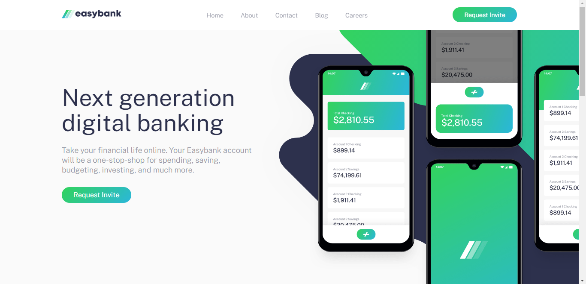

# Easybank landing page

This is a solution to the [Easybank landing page challenge on Frontend Mentor](https://www.frontendmentor.io/challenges/easybank-landing-page-WaUhkoDN). Frontend Mentor challenges help you improve your coding skills by building realistic projects. 

## Table of contents

- [Overview](#overview)
  - [The challenge](#the-challenge)
  - [Screenshot](#screenshot)
  - [Links](#links)
- [My process](#my-process)
  - [Built with](#built-with)
  - [What I learned](#what-i-learned)
- [Author](#author)
- [Acknowledgments](#acknowledgments)

## Overview

### The challenge

Users should be able to:

- View the optimal layout for the site depending on their device's screen size
- See hover states for all interactive elements on the page

### Screenshot



### Links

- Solution URL: [Add solution URL here](https://your-solution-url.com)
- Live Site URL: [Add live site URL here](https://your-live-site-url.com)

## My process

### Built with

- Semantic HTML5 markup
- CSS custom properties
- [Alpine.js](https://github.com/alpinejs/alpine) 
- Flexbox
- Desktop-first workflow

### What I learned

During the course of completing this project, I decided to use a JavaScript framework(Alpine.js) for the mobile navigation toggle. Alpinejs is a rugged, minimal framework for composing JavaScript behavior in your markup.

Below is a code snippet of how I was able to achieve the mobile navigation using Alpine.js

```HTML
<script defer src="https://unpkg.com/alpinejs@3.x.x/dist/cdn.min.js"></script> Include alpinejs to you markup
```

```HTML
<body x-data="{ isOpen: false }"> Add the x-data function to the body tag
```

```HTML
<div class="mobile-nav" id="mobileNav" x-show="isOpen">
    <nav>
      <ul>
        <li><a href="#">Home</a></li>
        <li><a href="#">About</a></li>
        <li><a href="#">Contact</a></li>
        <li><a href="#">Blog</a></li>
        <li><a href="#">Careers</a></li>
      </ul>
    </nav>
</div> Add x-show to the opening tag of the div to be toggled
```

```HTML
 add the x-on:click to the hamburger menu to enable toggle of the mobile menu
```

## Author

- LinkedIn - [Uzochukwu Victor Okafor](https://www.linkedin.com/in/uzochukwuokafor/)
- Frontend Mentor - [@uzoway](https://www.frontendmentor.io/profile/uzoway)

## Acknowledgments

I'll like to appreciate Matt Studert for the amazing worh he is doing with Frontend Mentor, providing this great designs to help Frontend Developer build realistic projects thereby developing coding skills